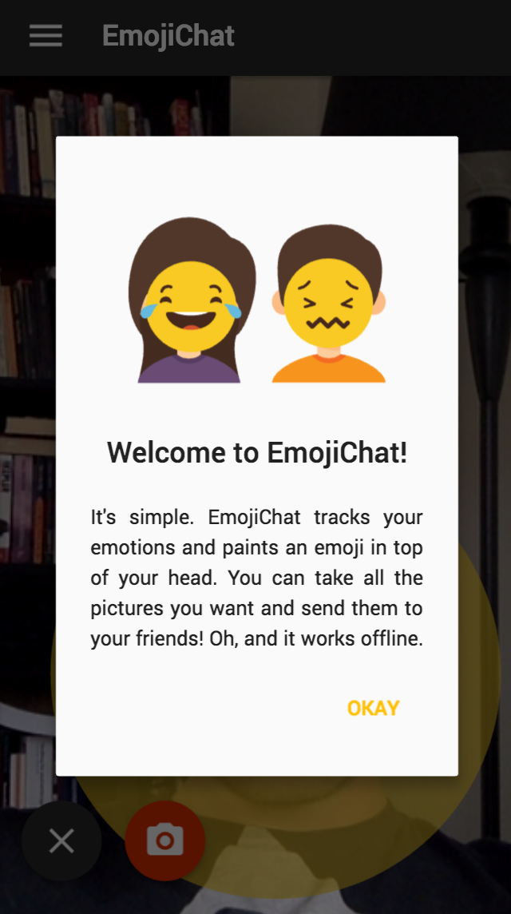

# EmojiChat

> Author: Frederik Wessberg (frra@itu.dk), June 2017

## Demo

EmojiChat is live at [https://itu.dk/people/frra/EmojiChat](https://itu.dk/people/frra/EmojiChat)

## Description

EmojiChat is a based on a simple concept: It tracks your and head position and facial expressions in real-time
and puts an Emoji on top of your head that represents your current mood.

## Technology

EmojiChat is a showcase of lots of buzzwords and new technologies:

- It is **Offline-First**. It uses a **Service-Worker** for precaching static assets and loads even when you are offline. It ships a custom **Storage** implementation for Offline data persistence based on LocalStorage rather than going over the network.
- It is **Mobile-First** and fully **responsive**. It is built from the ground-up to look and feel great on mobile devices and treats Mobile as separate compile-target.
- It follows the **Material Design** specification strictly. All elements, such as the `AppBarComponent`, `CardComponent`, `RippleComposite` and `FloatingButtonComponent` are custom and thorough implementations of the spec.
- It is **fully vanilla**, entirely built using **built-in browser and EcmaScript APIs and data structures** such as:
  - **Web Components**: It uses [**Custom Elements**](https://www.w3.org/TR/custom-elements/), encapsulates components using the [**Shadow DOM**](https://www.w3.org/TR/shadow-dom/) and stamps markup using [**HTML templates**](https://www.w3.org/TR/html-templates/).
  - **WebGL**: It uses **[WebGL](https://www.khronos.org/registry/webgl/specs/latest/2.0/)** for rendering the recognized facial model.
  - **Web Workers**: It computes emotions and facial expressions using **[Web Workers](https://www.w3.org/TR/workers/)** to keep the UI thread clean.
  - **Service Workers**: It precaches all static assets using a **[ServiceWorker](https://w3c.github.io/ServiceWorker/)** so the app can load and work even when you're offline.
  - **CSS Custom Properties**: It embraces CSS reusability and maintainability using **[CSS variables/CSS Custom Properties](https://www.w3.org/TR/css-variables-1/)**.
  - **Intersection- and Mutation Observers**: It tracks visible gallery items in just a few lines of code using the native **[IntersectionObserver](https://wicg.github.io/IntersectionObserver/)** and **[MutationObserver](https://developer.mozilla.org/en-US/docs/Web/API/MutationObserver)** APIs.
  - **Web Animations**: It uses the native **[Web Animations](https://www.w3.org/TR/web-animations-1/)** API for fluent, optimized animations.
  - **Pointer Events**: It uses the unified **[Pointer Events](https://www.w3.org/TR/pointerevents/)** spec for tracking pointer device events, rather than using traditional Mouse- and Touch-events.
  - **AOT Compilation**: It dedupes CSS selectors
  
Because of this, EmojiChat only works in **Chrome**, **Opera** and **Safari** for the time being. While Safari *is* supported, **Chrome and Opera will provide the best user experience for this showcase**.

## Installation instructions

1. Clone this repository using `git clone` from your terminal (or download it [here](https://github.com/wessberg/creative_implementation/archive/master.zip)).
2. `cd` into the directory.
3. Run `npm install`.

All dependencies will now be installed. You're now able to build the app!

## Build instructions

After installing the dependencies, there's a variety of build-scripts you can run:

- `npm run build` or `npm run b`: Generates a development bundle for both mobile and desktop devices.
- `npm run build:desktop` or `npm run b:desktop`: Generates a development bundle for only desktop devices.
- `npm run build:mobile` or `npm run b:mobile`: Generates a development bundle for only mobile devices.
- `npm run build:production` or `npm run b:production`: Generates a production bundle for both mobile and desktop devices. All files will be minified and gzipped, and all component styles will be deduped and minified using PostCSS and CSSNano. All `:hover` selectors will be stripped from the mobile bundle. 
- `npm run build:desktop:production` or `npm run b:desktop:production`: Generates a production bundle for only desktop devices. All files will be minified and gzipped, and all component styles will be deduped and minified using PostCSS and CSSNano.
- `npm run build:mobile:production` or `npm run b:mobile:production`: Generates a development bundle for only mobile devices. All files will be minified and gzipped, and all component styles will be deduped and minified using PostCSS and CSSNano. All `:hover` selectors will be stripped from the bundle.
- `npm run sw:precache`: Generates a *service-worker* file of all assets and associated hashes. Run this script whenever your assets change.

All of the `build` scripts also have equal `watch` or `w` variants for the same purpose, except they watch the source files and recompiles when something changes.
All of the `watch` scripts also have equal `serve` or `s` variants which serves a simple custom development server so you can easily work from localhost.

## Quirks

Due to the *Offline-First* nature of the app, the way Storage works is that *base64* versions of generated images are stored in `localStorage`.
Whenever that quota is exceeded, new images will not be saved. A better solution may be written, but for now it stands as a showcase.

